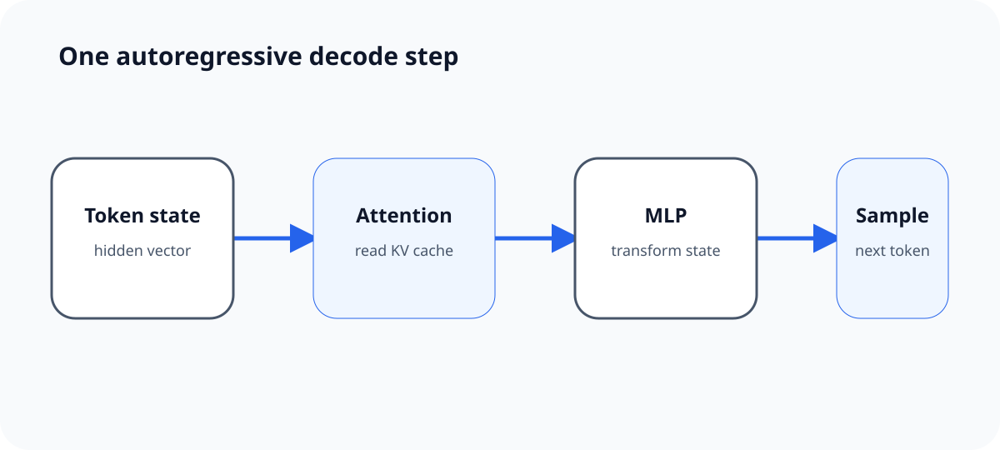
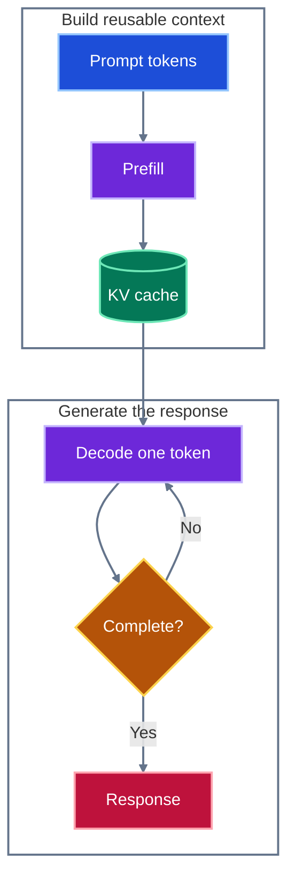

# Understanding LLM Inference Bottlenecks

> [!NOTE]
> **This is a living format demo.** It documents and exercises every article primitive supported
> by the portfolio while using LLM inference as a concrete thread.

Each article lives in its own folder under `posts/`. The folder contains a `README.md` and may
contain a local cover or other article media:

```text
posts/
└── understanding-llm-inference-bottlenecks/
    ├── README.md
    ├── cover.svg
    ├── inference-step.svg
    └── memory-signal.svg
```

The folder name creates the stable route: `/blog/understanding-llm-inference-bottlenecks`. An
explicit lowercase `slug` can be added to frontmatter when a route must remain independent of the
folder name.

## Frontmatter is the article contract

Every `README.md` begins with validated YAML metadata. Dates use `YYYY-MM-DD`, category is one of
`work`, `personal`, or `passion`, and tags use lowercase slugs.

| Field         | Required   | Purpose                               |
| ------------- | ---------- | ------------------------------------- |
| `title`       | Yes        | Article and metadata title            |
| `description` | Yes        | Search, cards, and page metadata      |
| `published`   | Yes        | Publication order and RSS date        |
| `updated`     | No         | Shown when different from publication |
| `category`    | Yes        | Primary blog section                  |
| `tags`        | Yes        | Related posts and filters             |
| `draft`       | No         | Excluded from production when `true`  |
| `featured`    | No         | Eligible for featured placement       |
| `cover`       | No         | Path relative to the article README   |
| `cover_alt`   | With cover | Describes a meaningful cover          |

The validator rejects impossible dates, duplicate tags or slugs, unknown categories, missing local
media, and covers without descriptive alternative text.

## Prose and structure

Articles support GitHub-flavored Markdown and MDX where it adds real value. That includes
**emphasis**, external [links to primary research](https://arxiv.org/abs/2211.05102), inline
`code`, and stable heading anchors.

> [!TIP]
> Lead with the claim a reader should remember, then use diagrams and code to make the mechanism
> inspectable.

Lists can express both hierarchy and progress:

1. Separate the two inference phases.
   - Prefill processes the prompt in parallel.
   - Decode produces one new token per sequence step.
2. Measure the constrained resource.
   - Compute-bound work rewards more arithmetic throughput.
   - Memory-bound work rewards moving model state efficiently.

- [x] Define the claim
- [x] Support it with a compact example
- [ ] Replace the illustrative measurements with experiment data in a future technical article

Tables remain horizontally contained on narrow screens:

| Phase   | Dominant shape                  | Common bottleneck        |
| ------- | ------------------------------- | ------------------------ |
| Prefill | Many prompt tokens in parallel  | Compute and memory mix   |
| Decode  | One token per active sequence   | Model-weight bandwidth   |
| Serving | Many independent user sequences | Scheduling and KV memory |

## Code examples

Fenced code is highlighted by the site build, receives responsive overflow behavior, and can carry
a descriptive title. Inline formulas that do not need a math renderer can remain code, such as
`bandwidth = bytes / seconds`.

```cpp title="bandwidth.cpp"
// Fictional values keep the format demo reproducible.
double bandwidth_gb_s(double bytes, double seconds) {
  return bytes / seconds / 1'000'000'000.0;
}

const double observed = bandwidth_gb_s(90'000'000'000.0, 0.12);
```

Terminal snippets use an exact language too:

```bash title="Validate an external blogs checkout"
pnpm validate -- --content-dir ../blogs/posts
```

## Static SVG illustrations

Article-specific vector diagrams live beside the Markdown source. The following SVG uses its own
light, dark, and forced-color palettes, so it remains a portable asset as well as a responsive blog
illustration.



## Reduced-motion-safe animation

Motion can clarify how state crosses a bottleneck, but the explanation must survive without it. This
local SVG plays once, finishes in a meaningful state, and immediately shows that final state when the
reader prefers reduced motion. Its replay control reloads the isolated SVG document, so the finite
animation can be inspected again without adding an article-level animation runtime.



## Mermaid diagrams

Mermaid is useful when relationships matter more than custom illustration. The source stays readable
in Markdown, while the portfolio renders light and dark SVG variants during the static build.



## Images, disclosure, and references

Normal Markdown images must have alternative text that conveys their purpose. Longer supporting
detail can stay tucked into native disclosure markup without requiring a custom component.

<details>
<summary>Why the KV cache matters</summary>

Without cached keys and values, decoding would recompute attention state for every earlier token on
every step. Caching exchanges that repeated work for a growing memory footprint.

</details>

Footnotes keep citations near the claim without interrupting the main explanation.[^static]

## Publishing workflow

1. Create a named folder with `README.md`.
2. Add and validate frontmatter.
3. Write the article and keep media beside it.
4. Open a pull request and pass the compatibility workflow.
5. Preview through the portfolio and set `draft: false` when it is ready.
6. Update the portfolio submodule pointer and create a portfolio release tag.

Reading time, category and tag data, related posts, previous/next navigation, RSS metadata, and the
article URL are derived at build time.[^static]

[^static]:
    The final website, including Mermaid diagrams and article media, is statically generated
    for GitHub Pages.
